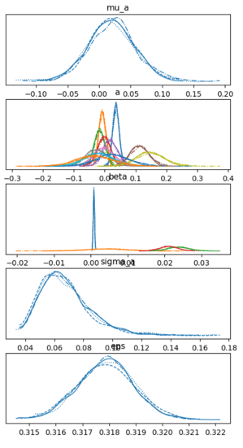
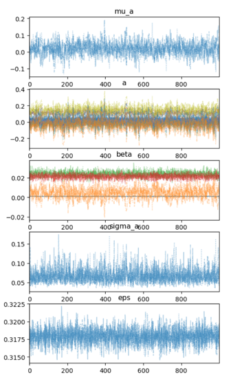
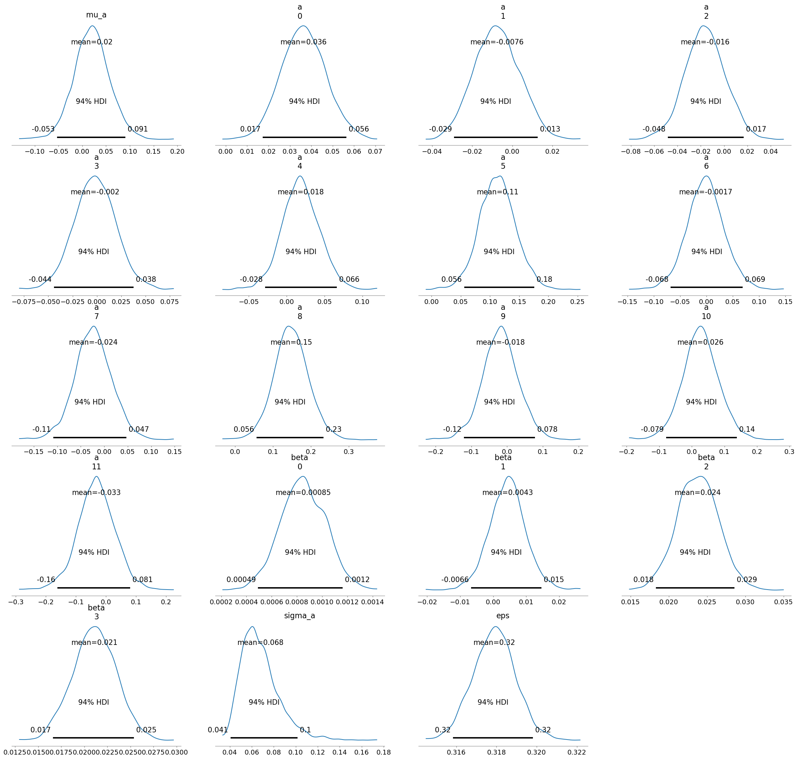
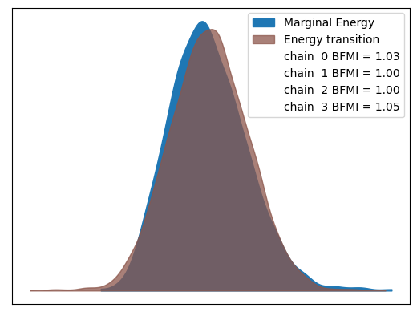

# Results
The outputs, including trace plots and posterior distributions, were examined to ensure the
reliability and interpretability of the results.
## Trace Plots and Posterior Distributions
### Posterior Distributions
The posterior distributions display the posterior
distributions for the parameters of the model,
including ‘µa‘, ‘α‘, ‘β ‘, ‘σa‘, and ‘ε‘.
These distributions show the range of values
that each parameter takes based on the sampled
posterior, with the peaks indicating the most
probable values.
‘µa‘ represents the overall mean intercept
across all groups. The distribution is centered
around a small value close to zero, indicating
that, on average, the group intercepts do not de-
viate far from zero.
‘β ‘ represents the coefficients for the pre-
dictors. The multiple overlapping distributions
reflect the different coefficients corresponding
to the different predictors (e.g., age, marital sta-
tus, education). The diversity in shapes and lo-
cations suggests varying impacts of these pre-
dictors on the outcome.
‘σa‘ reflects the variability between groups.
The distribution is narrow, suggesting limited
variability in groups. The distribution is cen-
tered around a small positive value, indicating
the average level of noise in the model’s predic-
tions.

### Trace Plots
Trace plots track the values of the parameters across the MCMC sampling iterations. The trace
plots for all parameters (‘µa‘, ‘a‘, ‘β ‘, ‘σa‘, ‘ε‘) exhibit good mixing and appear stable, indicat-
ing that the chains have converged. This means the MCMC sampling has adequately explored
the posterior distributions and is likely providing reliable estimates.

## Posterior Distributions with 94% HDI
This set of charts, displays the posterior distributions for individual
parameters, each accompanied by a 94% Highest Density Interval (HDI), which indicates the
range within which the parameter values lie with 94% probability.
The group-specific intercepts (a) reveal variability across different job categories, with some
groups exhibiting higher baseline effects than others. The β coefficients for the individual
predictors highlight the varying degrees of influence these factors have on the outcome. Some
coefficients have distributions tightly centered around zero, indicating a negligible effect, while
others have wider distributions, reflecting more significant impacts.
σa (as shown in the fourth plot of Figure 3): This parameter represents the variability in the
intercepts across different job categories, indicating how much the group-specific intercepts (a)
vary around the group-level mean (µa). The posterior distribution for σa is relatively narrow
and close to zero, with the 94% HDI spanning a small range. This suggests that the variabil-
ity between job categories is limited, meaning that while there are differences in the baseline
effects across job categories, they are not substantial.
ε (as shown in the fifth plot of Figure 3): This parameter represents the model error, capturing
the unexplained variability in the data that is not accounted for by the predictors and group-level
effects. The posterior distribution for ε shows a spread around a small positive value, with a
wider 94% HDI compared to σa. This indicates that there is a moderate level of unexplained
noise in the model, reflecting the inherent randomness or other unmeasured factors that affect
the likelihood of subscribing to a term deposit. The broader HDI for ε implies that there is
some uncertainty regarding the exact amount of noise in the model, but it is still constrained
within a reasonable range.

## Marginal Energy and BFMI in MCMC Sampling
I analyzed the Marginal Energy and
Energy Transition, along with the Bayesian Fraction of Missing Information (BFMI) for each
chain.
The accompanying plot illustrates the distribution of Marginal Energy (blue) and Energy Tran-
sition (brown) across the sampled states. The alignment between these distributions is crucial
for confirming that the MCMC sampler is transitioning smoothly between energy states, which
is indicative of effective sampling.
The BFMI values for the four chains—1.05, 1.05, 0.99, and 1.06—are all close to the ideal
value of 1. This indicates that the MCMC sampling performed efficiently, with each chain
exploring the posterior distribution thoroughly and without significant issues related to mo-
mentum resampling. The consistency of the BFMI values across all chains further supports the
robustness of the sampling process.

